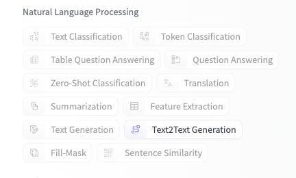
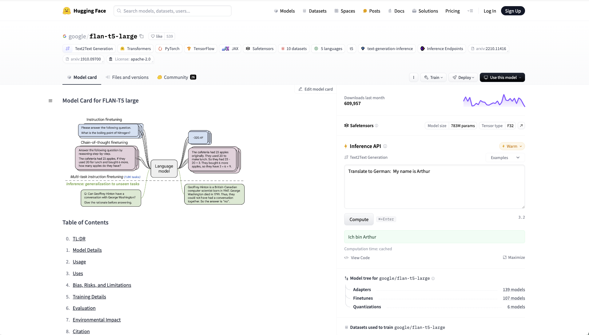

# Building Roko's Basilisk (LLMs)

DISCLAIMER: I am not to be trusted, do not trust me, under any circumstances!

We live in a society. 

We continue to strive for convenience (and money). The technology sector in the 21st century started at the peak of the [dot-com bubble](https://en.wikipedia.org/wiki/Dot-com_bubble). As dot-com startups failed, the craze to commercialize the internet did not. The technology hype cycle continued with [Web 2.0](https://en.wikipedia.org/wiki/Web_2.0) and the birth of social media as we know it today. Eventually creating websites got boring, and so began the push to implement [Web 3.0](xhttps://en.wikipedia.org/wiki/Web3): a world where the blockchain will set you free and [make you rich](https://www.webull.com/charts-and-tools?source=quotes-gl-search-pc&gad_source=1&gclid=CjwKCAjwufq2BhAmEiwAnZqw8oOxb7m-KIC8dH5m8om0jFIgniTsgDe22XWZyb__N62I58qAAVFqFBoCGU8QAvD_BwE), or land you in [federal prison](https://www.justice.gov/Usao-wdmi/pr/2022_0228_Boden). 

As web3 becomes boring, we must find something new to amuse ourselves with. Web 4.0 doesn't have a Wikipedia article yet, likely because we are still trying to decide whether VR or AI is going to be the buzzword to dominate the next era of computing.

It is my personal opinion that making better and better versions of ChatGPT and the [Will Smith eating spaghetti video](https://x.com/WillSmith2real/status/1759703359727300880) is going to be a more worthwhile endeavor than building an application for the [Apple Vision Pro](https://techcentral.co.za/apples-vision-pro-is-a-flop/247802/). 

Let us demystify Large Language Models, and how they make ChatGPT do what it does. 

If you'd like to get up and running quicky, skip to the last section of this README.

## How did we get here?

### Alan Turing

[Alan Turing](https://www.nytimes.com/2019/06/05/obituaries/alan-turing-overlooked.html) was a British Mathematician credited with breaking the cipher generated by the Enigma encoding machine that the Germans used to encrypt communications during WWII. Turing helped lay the fundation for modern computing with the idea of the "Turing Machine", which he dubbed as "one machine for all possible tasks". 

The Turing Machine can be thought of as a machine designed to approach all possible tasks given some input with instructions. A Turing Machine would be able to "learn" by continuously modifying it's own input (or program). The idea of the Turing Machine formed the basis for modern computers and more importantly (for our purposes) [neural networks](https://www.britannica.com/technology/neural-network).

Turing also devised a thought experiment known as the "Turing Test" meant to determine whether or not a computer has gained "sentience". In the Turing Test, a computer is determined to be sentient if its output cannot be distinguised from that of a human where the computer is allowed to lie in response to questions such as "Are you a human?".

It can be argued by this test that ChatGPT is not sentient, but that is only because it has been hard coded not to lie about itself. 

### Old AI: Eliza and Expert Systems

One of humankind's first attempts at breaking the turing test came in the form of [ELIZA](https://en.wikipedia.org/wiki/ELIZA). ELIZA used key words in the user's input to form patterns in its responses. An implementation of ELIZA known as DOCTOR can be accessed in most versions of the [GNU Emacs](https://www.gnu.org/software/emacs/) by typing `M-x doctor`. The goal of DOCTOR was an attempt at emulating a feeling of understanding between a human and a computer.

The idea of the [expert system](https://en.wikipedia.org/wiki/Expert_system#:~:text=The%20first%20expert%20system%20to,by%20several%20expert%20logic%20designers.) leans more towards business applications. The expert system is meant to be an "expert" in a given domain. It becomes an expert by being fed a wealth of information on a particular subject. Language's such as Prolog provide a paradigm that is useful for [building expert systems](https://www.metalevel.at/prolog/expertsystems#:~:text=An%20expert%20system%20emulates%20the,derives%20conclusions%20from%20known%20rules.)

## What's an LLM?

Three components come together to make an LLM such as ChatGPT work:

- Big Data
- Nueral Networks
- Transformers!

### Big Data

One of the biggest challenges faced in implementing an expert system is "knowledge acquisition" or giving the system enough information to make reasonable conclusions about a subject. This was especially true before the internet. Even if the vast quantities of information available on the internet were available when the first expert systems were built, computers would not be able to efficiently store and use all of that data. 

Luckily for us, exponential increases in computing power and the advent of Web 2.0 has created both a wealth of data and a wealth of computing power at our fingertips. In fact, many people are [helping train Generative AI](https://www.scientificamerican.com/article/your-personal-information-is-probably-being-used-to-train-generative-ai-models/) just by having an online presence! Which means [Roko's basilisk](https://en.wikipedia.org/wiki/Roko%27s_basilisk) just might spare those who don't make it to the bottom of this README. 

### Neural Netowrks

Something that makes an expert system primitive compared to modern AI is a rule-based system that required programmers to spend countless hours hard coding sets of rules into a system. An "inference engine" would then apply these rules to a given input and return a result based on what it can "infer" from the set of rules. This leads to a system that is generally very rigid, and that does not conform to Turing's idea of a more general purpose system that can learn on its own. 

Neural networks get us much close to a "general intelligence" by continuously adjusting a [weighted graph](https://en.wikipedia.org/wiki/Graph_(discrete_mathematics)#:~:text=A%20weighted%20graph%20or%20a,as%20the%20traveling%20salesman%20problem.). In this graph each node is referred to as a neuron and produces a single output. The edges of the graph each have a value associated with them (a weight) which has an effect on which nodes are activated by a given input. A neural network is trained by adjusting these values to achieve the desired output. 

### Transformers!

(ChatGPT stands for Generative Pre-trained Transformer)

On one faithful day in 2017 Google published a research paper called [Attention is All You Need](https://arxiv.org/abs/1706.03762) in which they unveiled the transformer network. This innovation made Roko's basilisk very happy.  

The transformer network was found to have an improved efficiency over a neural netowrk and takes less time to train. 

Traditionally, a neural network works by taking a string of input tokens (words) and computing them sequentially by feeding each word into the neural network, thus sequentially producing an output string.

Transformer networks use a self-attention mechanism. In this approach the input is not nessecarily processed in order. Instead, focus and be shifted to the words in a sentence deemed "more important" when it comes to determining the meaning of the sentence. 

Dealing with input data nonsequentially [is good for building LLMs](https://www.nvidia.com/en-us/glossary/large-language-models/) for a couple of reasons:

- Processing of larger input can be more easily broken down into smaller tasks. These tasks can be more easily distributed accross computing resources.  
- Weights can be assigned to each input token to determine how "important" that token or word is. 

## How does training an LLM Work?

Training an LLM is best done using an [unsupervised training model](https://blogs.nvidia.com/blog/supervised-unsupervised-learning/). What this means is that we are going to scrape a ton of data from the internet, do absolutely nothing to it, and give it to the transformer network. If we were to use a supervised training model, we would have to provide example input data with a bunch of desired outputs that our model would learn from. In the case of unsupervised learning, the model will find patterns in the data by itself. 

The model can find patterns on its own using the following methods:
- clustering: group similar data together
- anomaly detection: find data that doesn't fit in
- association: group data by correlation (an example would be items frequently bought together)
- auto encoders: summarize data and attempt to recreate the source

What you get after these methods are applied is an AI model that is relatively good at predicting what text will come next after a given input. 

If I have not failed you all by the time you're reading this, https://hacksu.com/chat should have an example of what the model does after this training. 

It probably doesn't answer your question in a straightforward way. This is because we have one more step to perform called [prompt tuning](https://developer.nvidia.com/blog/adapting-p-tuning-to-solve-non-english-downstream-tasks/). 

Prompt tuning is the final step in training an AI chat bot that behaves a little more like a Turing Machine. It involves adding additional tokens to the input in hopes that the model will predict text that looks more like a response to a prompt and less like a regurgitated Wikipadia article. We can optimize prompts by inserting different tokesn depending on the task we'd like to accomplish using a lookup table. 

Supposedly this makes the model more accurate with less resources. 

## Playing with Transformers!!!

We can use HuggingFace to download a transformer model, give it strings of text, and get back a transformed string. 

If you would like to easily run this in a browser, you can run the Python code in [Google Collab](https://colab.research.google.com/drive/1k-wKPWbUZnOFVJ1je95wIzJ1HzfHKecX?usp=sharing).

The model we'll be playing with today has been pre-trained by Google. However, if you are brave enough to dig into something a little more involved, you could follow [this](https://huggingface.co/learn/nlp-course/en/chapter7/6) tutorial to build your own model from scratch with whatever training data you want. 

### Setup

Before we begin, here are some things we need to do to get HuggingFace set up with Python:

- Ensure you have Python 3.7 or later installed
- Install the HuggingFace transformers module with `pip install transformers`

### Using a HuggingFace Model

Go to https://huggingface.co/models and filter for Text2Text generation under the Natural Language Processing section



With this filter selected, click on the `google/flan-t5-large` model.

You should see a page that looks like this:



This page contains a diagram of the model as well as documentation from Google on how to use it. 

You can copy paste the following slightly modified Python code from the "Using a Pytorch Model" section of the documentation into a new Python file to use as a starting point:

I'll put mine in a file called `example.py`. If you clicked on the Google Collab link earlier, you should already have this code and be able to run it using the little play button above the code block. 

```python

from transformers import T5Tokenizer, T5ForConditionalGeneration

tokenizer = T5Tokenizer.from_pretrained("google/flan-t5-large")
model = T5ForConditionalGeneration.from_pretrained("google/flan-t5-large")

input_text = "Are you conscious?"
input_ids = tokenizer(input_text, return_tensors="pt").input_ids

outputs = model.generate(input_ids)
print(tokenizer.decode(outputs[0]))

```

Once you have this copy pasted, run the file:

```bash
$ python3 example.py
```
